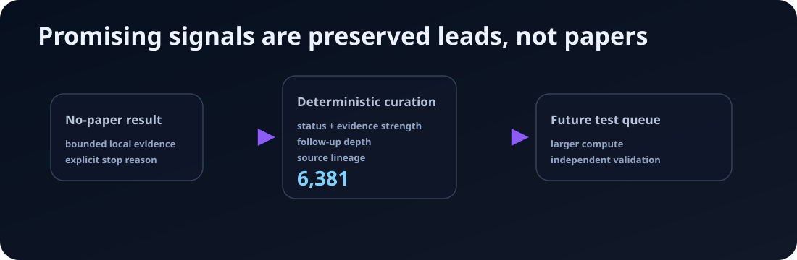

# Enoch Promising Signals



**A public preservation lane for useful Enoch results that are not papers.** This repo keeps bounded local signals, stop reasons, curation buckets, and next-test ideas visible instead of letting no-paper results disappear into private logs.

## Current export

The current export contains 6381 deterministic, contract-clean signals from the Enoch control plane.

| Public fact | Count |
| --- | ---: |
| Total deterministic signal rows | `6381` |
| `useful_signal` | `6,309` |
| `compute_scale_blocked` | `72` |
| Top external-researcher candidates | `2,194` |
| Follow-up recommended | `3,263` |
| Compute-scale blocked bucket | `72` |
| Weak/local-only preserved signals | `129` |
| Likely stale/low-value archive | `723` |

Start with the generated [ranked index](signals/ranked-index.md). The generated title index is in [signals/index.md](signals/index.md). Machine-readable source of truth is [data/signals.jsonl](data/signals.jsonl), ranking metadata is in [data/ranking.json](data/ranking.json), and count/status accounting is in [data/manifest.json](data/manifest.json).

## What belongs here

A record belongs here only when deterministic control-plane fields mark it as one of:

- `useful_signal`
- `promising_if_scaled`
- `compute_scale_blocked`

A record does **not** belong here when it is paper-positive, already imported into the public corpus, missing required claim/evidence boundaries, or only supported by an LLM interpretation without a deterministic control-plane field.

## How to read a signal

Each generated signal page records:

- what looked useful;
- the boundary and scale limit;
- the claim scope;
- why the run stopped without becoming a paper;
- the recommended next action;
- deterministic curation metadata;
- a do-not-overclaim warning.

These are **not validated papers**, **not peer reviewed**, **not publication-positive Enoch corpus artifacts**, and **not the paper corpus**. They are leads for follow-up, critique, larger-compute validation, or archival comparison.

## Ranking rule

Ranking is deterministic. Bucket labels and scores are derived only from exported fields: evidence strength, hypothesis status, source lineage, compute-scale status, follow-up metadata/depth, and local evidence artifact references. No LLM review or manual judgment is allowed to become ranking truth unless a validator can recompute it.

## Related Enoch surfaces

- System/control plane: <https://github.com/alias8818/enoch-agentic-research-system>
- Generated research corpus: <https://github.com/alias8818/enoch-ai-research-corpus>
- Hosted docs: <https://solo-09d10f60.mintlify.app/>
- Hugging Face dataset: <https://huggingface.co/datasets/aliasocracy/enoch-ai-research-corpus>

## Regeneration

The exporter lives in the system repo:

```bash
python3 scripts/export_promising_signals.py --output-repo ../enoch-promising-signals --clean-only
```

Validate the generated repository with:

```bash
python3 scripts/validate.py
python3 scripts/validate_public_trust_surfaces.py
```
